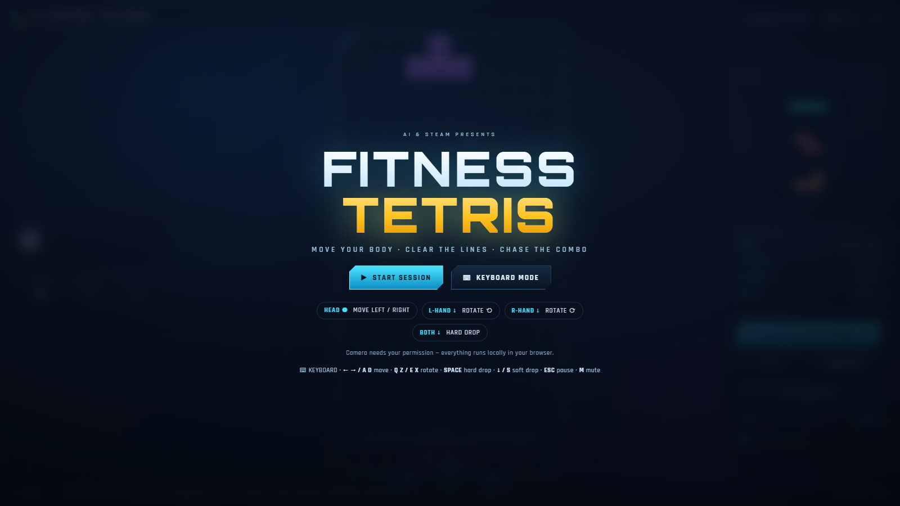
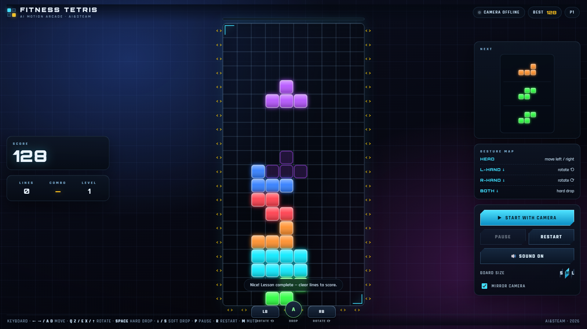
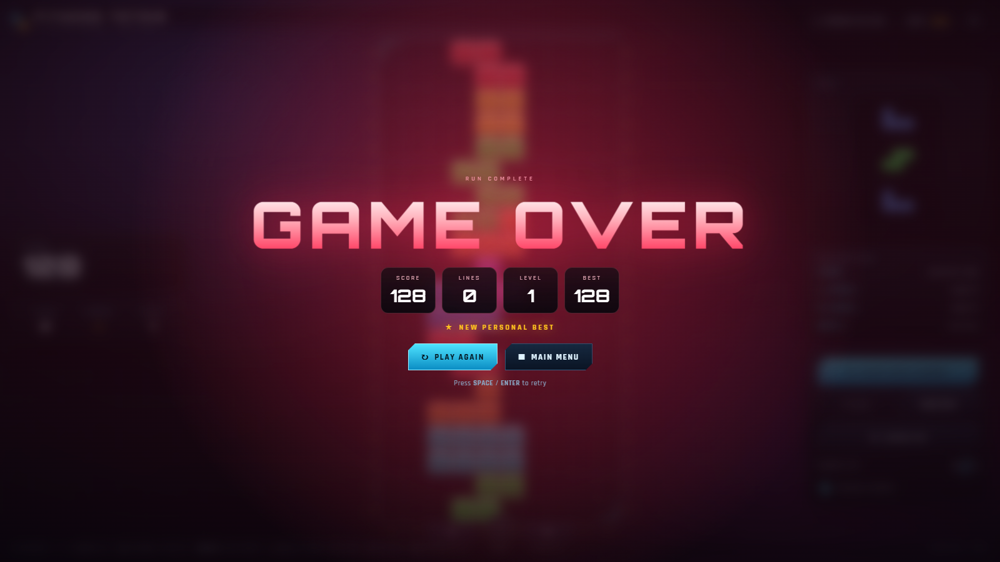

# AI Fitness Tetris 🎮

A **webcam-controlled Tetris** — steer with your head, rotate and drop with your hands.
Built as a classroom demo for an **AI & STEAM** programme. Runs 100% in the browser
(pose inference is local), no build step, no backend.







## Features
- **Full-screen camera stage** — the live camera fills the screen and the whole HUD floats on top of it
- **Adjustable playfield (S / M / L)** — default M is sized so the board reads clearly from 2–3 m away in a classroom
- **Level 1 is a tutorial level** — 4 guided tasks (move / rotate ⟲ / rotate ⟳ / hard drop) with pop-up prompts, `✓ NICE!` feedback and a `LEVEL 1 COMPLETE` payoff
- Console-grade UI: attract screen, HUD rails, **NEXT ×3** queue, ghost piece, danger pulse, line-clear flash, and a **GAME OVER** pop-up with run stats
- **Full keyboard mapping with DAS auto-repeat** (frame-synced hold-to-move)
- **Head control that stays put** — tilt further to shift more cells; returning your head to centre never drags the piece back
- **BGM + 12 SFX synthesized with WebAudio** — zero audio assets; toggle with the 🔊 button or `M`
- Best score persisted locally (localStorage)

## Controls

| Action | Gesture | Keyboard |
|---|---|---|
| Move left / right | head tilts left / right (tilt further = more cells) | `←` `→` or `A` `D` (hold = repeat) |
| Rotate ⟲ / ⟳ | left / right hand pushes down | `Q` `Z` / `E` `X` `↑` |
| Hard drop ⚡ | both hands push down | `SPACE` |
| Soft drop | — | `↓` or `S` (hold = repeat) |
| Pause / resume | — | `P` or `ESC` |
| Restart | — | `R` |
| Skip tutorial | — | `ESC` (during Level 1) |
| Mute / unmute | — | `M` |

## Run

**▶ Play online:** <https://ikeee.github.io/ai-fitness-tetris/> — served over HTTPS, so the camera works right away.

Or run it locally. Camera access requires a **secure context**, so serve over `localhost` (not `file://`):

```bash
python serve.py        # → http://127.0.0.1:8000/
```

First launch downloads MediaPipe Tasks Vision from jsDelivr and the pose model from Google Storage;
after that, inference runs locally in the browser. Keyboard mode works without a camera.

## Tech

Plain HTML / CSS / JS (ES modules) · Canvas 2D rendering · [MediaPipe Pose Landmarker](https://developers.google.com/mediapipe) (Apache-2.0) · WebAudio synthesis for all music & SFX.

Bundled fonts: **Orbitron** and **Rajdhani** (SIL Open Font License 1.1) in `fonts/` — no CDN needed at runtime.

## Layout

```
index.html      page structure (attract screen, HUD rails, tutorial HUD, game-over overlay)
styles.css      fullscreen console styling (glass HUD, animations, responsive rules)
app.js          game logic, pose control, tutorial state machine, keyboard DAS, audio engine
serve.py        tiny static server for localhost camera use
fonts/          Orbitron + Rajdhani (woff2, offline)
_screenshots/   reference captures of the current build
_backup_v1_2026-09-21/   the original 1:1 clone of the reference video (pre-redesign)
```

## Version

- **v0.02** — classroom readability + control fix: S/M/L playfield size presets (default M = +19.6 % linear / +43 % area), higher-contrast blocks and brighter grid, and reworked head control (absolute neutral + outward-only ratchet — coming back to centre no longer drags the piece back).
- **v0.01** — first versioned release: fullscreen console layout, tutorial level, full keyboard mapping + DAS, synthesized music & SFX, game-over screen.

---

### 中文速览

体感俄罗斯方块网页版：**摄像头铺满全屏、所有信息叠加在画面上**；**第一关是教导关**（弹屏文字引导，做出动作才过关）；
键盘全键位：`←→ / AD` 移动、`Q Z / E X / ↑` 旋转、`SPACE` 硬降、`↓ / S` 软降、`P / ESC` 暂停、`R` 重开、`M` 静音；
BGM 与 12 种音效全部由 WebAudio 现场合成（零素材）。

运行：`python serve.py` → 打开 <http://127.0.0.1:8000/>
